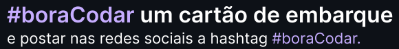

<h3 align="center">DESAFIO ROCKETSEAT</h3>
<h1 align="center">
  
</h1>

Projeto desenvolvido com café ☕ e código 👨‍💻

DEPLOY  <a href="https://Cartao-de-embarque.renanpaes92.repl.co" target="_blank">[ Replit ] 🔗</a>

##  🖼️ Banner de apresentação

## 💻 Projeto

Uma Calculadora.

Este foi um projeto desenvolvido como resposta ao desafio #6 do **[boracodar](https://boracodar.dev/#)**.

##  📱 Contate-me!

  
Código desenvolvido por <a href="https://www.linkedin.com/in/renanpaes92/" target="_blank">Renan Paes</a>

  
  
  

##  💡 Tecnologias utilizadas

- [x] HTML
- [x] CSS
- [x] GIT / GITHUB

##  ✒️ Autor

##  🌎 Licença

Este projeto está sob a licença do MIT. Consulte o arquivo [ LICENÇA ](https://github.com/VagnerNerves/productcard-boracodar/blob/master/LICENSE) para obter mais detalhes.
